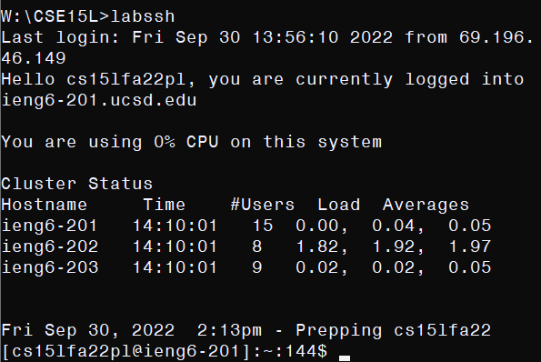

# Remote Access

## Installing VS Code

Go to https://code.visualstudio.com/ and download the installer, then run it. After completing its instructions, VS code is installed.<br>


## Remotely Connecting

Now you will connect to a remote machine in order to work on it. Access to such a remote machine is allocated to you by UCSD. run ```ssh cs15lfa22XX@ieng6.ucsd.edu``` in the command line, where ```XX``` are unique to you (see this at the UCSD ETS site here: https://sdacs.ucsd.edu/~icc/index.php). It will prompt a password (this must be set through the global password reset tool on the ETS site). If entered correctly, you would connect to the remote machine and be able to execute commands on it. <br>


## Some Commands

If you have ```ssh```ed over to the remote UCSD machine, you are now using Linux. Here are some useful commands:

- ``ls -a``: List the contents of your immediate directory. ``ls`` alone will tell you non-hidden contents, but ``-a`` reveals hidden contents as well. Useful for knowing what directories you can ``cd`` to.
- ``cd <directory>``: Move to another directory.
- ``cd ../``: Move back out of a directory to its parent directory.
- ``cat <file>``: Read out the contents of a file. If it is not a text file (all code is inherently stored in text files), it will be garbage.
- ``mkdir <newdirname>``: Make a new, empty directory in the immediate directory.
- ``touch <filename>``: Create an empty file.
- ``mv <directory> <newdirname>``: Rename a directory.
- ``rename <file> <newfilename>``: Rename a file.
- ``cat <fileA> >> <fileB>``: Attach the contents of file A to file B. Independently, what ``>>`` does is it takes console output and puts it in a file. Ergo, ``cat`` puts the contents of file A into console output and ``>>`` consequently attaches them to file B.
- ``exit``: Disconnect from the remote machine and return the terminal to running commands locally. 

In this example, I see what is in the immediate directory where I appear after ```ssh```ing, make a new directory named ```.cow```, verify it exists by seeing the contents again, move to ```.cow```, create an empty file ```coww```, back out, and disconnect.


## The ```scp``` Command

- ```scp <file> cs15lfa22pl2ieng6.ucsd.edu:<path>``` copies a file from the immediate filesystem (which could be on your local computer) to the specified path on the remote machine (when you ```ssh``` you are in the home directory, its path is ```~\```). This is very useful if you wish to edit files on your computer and run them remotely.


## Setting Up SSH Keys

I have no password prompt when I ssh. What must be done to have this is these things:
- run ```ssh-keygen```, which will prompt you to enter a path for its output and will ultimately generate two files, called ```id_rsa``` and ```id_rsa.pub```. Other options can be used to change the nature of this, but for now this is enough.
- ```scp``` the .pub file to the path ```~/.ssh/``` (this will be hidden) on the remote machine.
- On the remote machine, in ```~/.ssh/``` attach the contents of the .pub file to an (otherwise empty) file called ```authorized_keys```.
- If you are on Windows! Open an administrator instance of Powershell (search for Powershell on your computer, 'run as administrator') and enter these commands:
1. ``Get-Service ssh-agent | Set-Service -StartupType Automatic``
2. ``Start-Service ssh-agent``
3. ``Get-Service ssh-agent``
4. ``ssh-add <path of the id_rsa file>``

After this, you will be able to ```ssh``` with no password entry needed.


## Optimizations

Typing ```ssh cs15lfa22xx@ieng6.ucsd.edu``` is arduous. It is possible to optimize this with ```.bat``` files on Windows and shell scripts on Linux. I am using Windows, but the same is analogous for Linux: a .bat (batch) file contains commands which can be executed in a terminal all at once. Here are the contents of my ```labssh.bat``` file:

```
@echo off

ssh cs15lfa22pl@ieng6.ucsd.edu
```

I can now just type `labssh` to connect.

