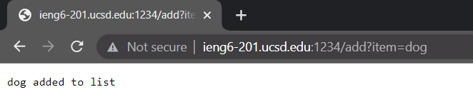
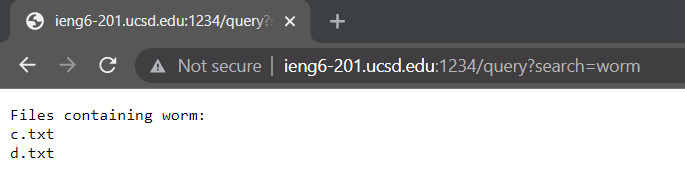
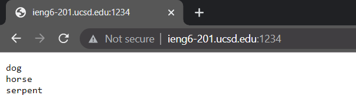

# Search Engine / Debugging

## Search Engine

Here is the code for a very basic search engine, which builds up a list of items and can display the list of items, and can also search through a file system to find if any files contain a phrase:

```
import java.io.IOException;
import java.net.URI;
import java.util.ArrayList;

import java.io.File;
import java.util.List;
import java.util.Scanner;

class SearchHandler implements URLHandler {

    ArrayList<String> list;

    public SearchHandler() {
        list = new ArrayList<String>();
    }

    public String handleRequest(URI url) {
        String path = url.getPath();
        if(path.equals("/")) {
            String retStr = "";
            for(int i = 0; i < list.size(); i++) {
                retStr += (list.get(i) + '\n');
            }
            return retStr;
        } else if(path.contains("/add")) {
            String query = url.getQuery();
            String[] param = query.split("=");
            if(param[0].equals("item")) {
                list.add(param[1]);
                return (param[1] + " added to list");
            }
            return "Query failed";
        } else if(path.contains("/query")) {
            String query = url.getQuery();
            String[] param = query.split("=");
            if(param[0].equals("search")) {
                String phrase = param[1];
                List<File> files = new ArrayList<>();
                try {
                    files = getFiles(new File("files"));
                } catch (IOException e) {}
                String out = "Files containing " + phrase + ":\n";
                for(File f: files) {
                        if(fileContains(phrase, f)) out += f.getName() + "\n";
                }
                return out;
            }
            return "Query failed";
        } else {
            return "404 not found";
        }
    }

    boolean fileContains(String phrase, File file) {
        try {
                Scanner scan = new Scanner(file);
                String line;
                boolean found = false;
                while(scan.hasNextLine() && !found) {
                        line = scan.nextLine();
                        found = line.contains(phrase);
                }
                return found;
        } catch(Exception e) {return false;}
    }

    List<File> getFiles(File start) throws IOException {
            File f = start;
            List<File> result = new ArrayList<>();
            if(f.isDirectory()) {
            File[] paths = f.listFiles();
            List<File> deepFiles = new ArrayList<>();
            for(File subFile: paths) {
                if(subFile.isDirectory()) {
                    deepFiles = getFiles(subFile);
                    for(File dfile: deepFiles) result.add(dfile);
                } else {
                    result.add(subFile);
                }
            }
            } else {
            result.add(start);
        }
            return result;
        }
}

class SearchEngine {

    public static void main(String[] args) throws IOException {
        if(args.length == 0) {
            System.out.println("Enter a port");
            return;
        }

        int port = Integer.parseInt(args[0]);
        Server.start(port, new SearchHandler());
    }
}
```

Here are examples of it in use:<br>

<br>
This is a screenshot of the add query page. The server is hosted through port 1234. The `handleRequest` method is called with the argument "http://ieng6-201.ucsd.edu:1234/add?item=dog", from which it clips the path with the `getPath` method and puts in `path`, the path being being /add. A sequence of `if, else` statements checks `path` on a case by case basis for the presence of /add, after which the query of the url is clipped with the `getQuery` method and placed into `query`, then broken by the `=` character into an array of the query parameters, `params`. The `query` string is determined from `params`, then added to an ArrayList. In this case, the query string is "dog", so "dog" has been added to an ArrayList, `list`. This ArrayList's contents are displayed in Example 3. Relevant code:

```
String path = url.getPath();
    ...
    } else if(path.contains("/add")) {
        String query = url.getQuery();
        String[] param = query.split("=");
        if(param[0].equals("item")) {
            list.add(param[1]);
            return (param[1] + " added to list");
        }
        return "Query failed";
    } ...
```


<br>
This is a screenshot of the search query page. The `handleRequest` method is called with the argument "http://ieng6-201.ucsd.edu:1234/query?search=worm", from which it again clips the path and looks for the presence of /query in it. The query is split off again and put into a string `query`, and broken into `params`. A list of Java `File` types `files` is made. The method `getFiles` is then used, which sorts through directories compiling a list of all files within them. If the file path given to it is a file, it will add it to the list, and if it is a directory, it will recursively  go deeper and create a list of files for that subdirectory, and add them. Then, with the `fileContains` method, it can be determined if the `search` parameter (`params[1]`) is present in the files, and the method returns a text list of the files which do contain the search parameter. In this case, the search parameter is worm, and c.txt and d.txt contain this phrase respectively:
```
head
worm
```
```
dog
worm
```
Relevant code:
```
...        
        } else if(path.contains("/query")) {
            String query = url.getQuery();
            String[] param = query.split("=");
            if(param[0].equals("search")) {
                String phrase = param[1];
                List<File> files = new ArrayList<>();
                ...
                files = getFiles(new File("files"));
                ...
                String out = "Files containing " + phrase + ":\n";
                for(File f: files) {
                        if(fileContains(phrase, f)) out += f.getName() + "\n";
                }
                return out;
            }
...

boolean fileContains(String phrase, File file) {
    try {
            Scanner scan = new Scanner(file);
            String line;
            boolean found = false;
            while(scan.hasNextLine() && !found) {
                    line = scan.nextLine();
                    found = line.contains(phrase);
            }
            return found;
    } catch(Exception e) {return false;}
}

List<File> getFiles(File start) throws IOException {
    File f = start;
    List<File> result = new ArrayList<>();
    if(f.isDirectory()) {
        File[] paths = f.listFiles();
        List<File> deepFiles = new ArrayList<>();
        for(File subFile: paths) {
            if(subFile.isDirectory()) {
                deepFiles = getFiles(subFile);
                for(File dfile: deepFiles) result.add(dfile);
            } else {
                result.add(subFile);
            }
        }
    } else {
        result.add(start);
    }
    return result;
}
```

<br>
This is a screenshot of the main page, displaying the contents of the `ArrayList` to which the word dog was added. To load this page, `handleRequest` is called with the URL argument "http://ieng6-201.ucsd.edu:1234/", clips the path, which is `/`, and simply returns the contents of `list` in order. After dog was added, horse and serpent were added as well. Relevant Code:

```
ArrayList<String> list;

    public SearchHandler() {
        list = new ArrayList<String>();
    }

    public String handleRequest(URI url) {
        String path = url.getPath();
        if(path.equals("/")) {
            String retStr = "";
            for(int i = 0; i < list.size(); i++) {
                retStr += (list.get(i) + '\n');
            }
            return retStr;
```

## Debugging

### Linked List Append Bug

Buggy:
```
public void append(int value) {
    ...
    Node n = this.root;
    // If it's just one element, add if after that one
    if(n.next == null) {
        n.next = new Node(value, null);
        return;
    }
    // Otherwise, loop until the end and add at the end with a null
    while(n.next != null) {
        n = n.next;
        n.next = new Node(value, null);
    }
}
```
The symptom of the bug present in this code is an unending loop preventing the program from completing. The failure inducing input that prompted this was attempting to append to a list with more than two elements, in particular `-3` to `1, 2`. Reading the code, it becomes clear the bug will occur in the while loop. In particular, the code tries to find the last element by checking if the current node's `next` is `null`, but in the same loop sets `n`'s `next` as a new node, which means there will never be a node with a non-null `next`. The fix needed is as such:
```
public void append(int value) {
    ...
    Node n = this.root;
    ...
    // Otherwise, loop until the end and add at the end with a null
    while(n.next != null) {
        n = n.next;
    }
    n.next = new Node(value, null);
}
```

The unnecessary creation of a new node in `next` is removed outside of the loop. Now the code reaches the last element in the list successfully, creates a new node in the last element's `next`, and the unending loop is no longer caused. The reason why a list with two or more elements were needed is because the implementation has successful edge cases for the cases that there are 0 or 1 elements in the list.

### Array Reversed Bug

Buggy:
```
static int[] reversed(int[] arr) {
    int[] newArray = new int[arr.length];
    for(int i = 0; i < arr.length; i += 1) {
        arr[i] = newArray[arr.length - i - 1];
    }
    return arr;
}
```
The symptom of the bug present in the program is that all of the elements of the returned array are `0`, regardless of what was in the array. Any non-empty array is a failure inducing input, but for me was `{1 2 3 4 5}`. The bug arises from that `newArray` is created, and then values are copied from it into the parameter `arr` by mirrored indices, but all of the values in `newArray` are initialized to `0`. The parameter `arr` is consequently zeroed and is returned, instead of its reverse. The fix is as such:

```
static int[] reversed(int[] arr) {
    int[] newArray = new int[arr.length];
    for(int i = 0; i < arr.length; i += 1) {
        newArray[i] = arr[arr.length - i - 1];
    }
    return newArray;
}
```
Now values are copied by mirrored indices from `arr` into `newArray`, and `newArray` is returned rather than the `arr`. Because values are now copied out of `arr` in correct mirrored order, `newArray` is successfully with the reverse of `arr`. Ergo, the symptom of a zeroed array is no longer caused.