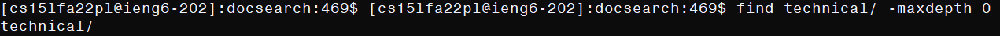
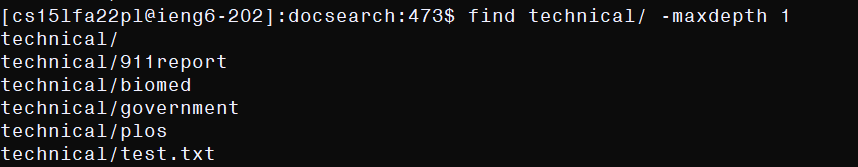
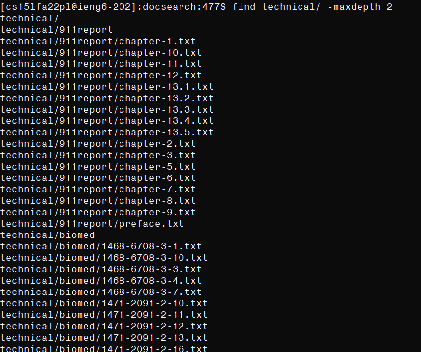
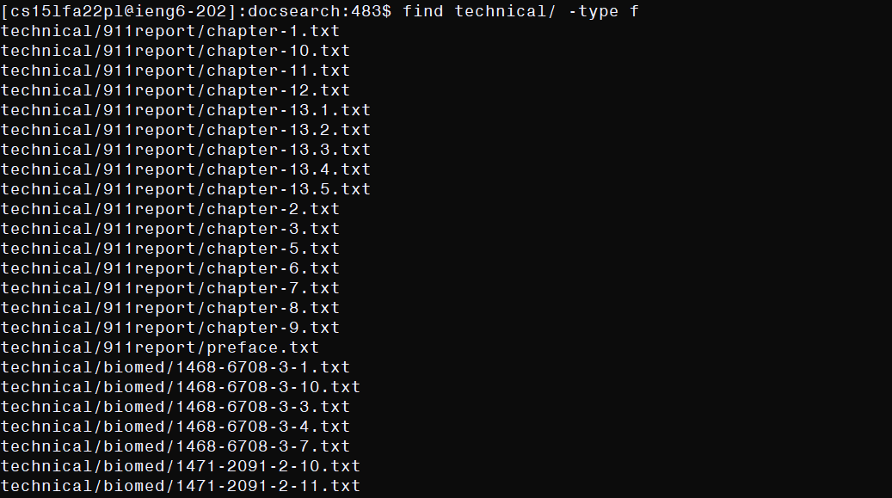
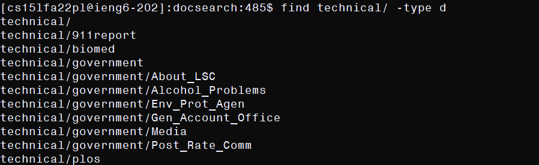
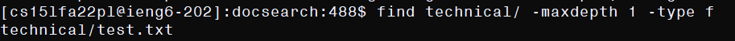
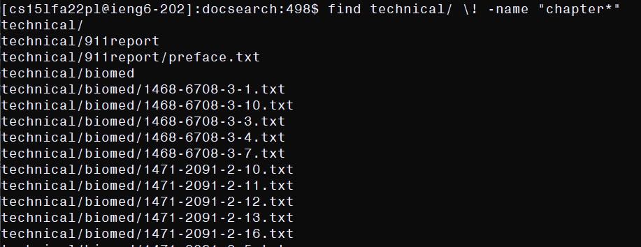
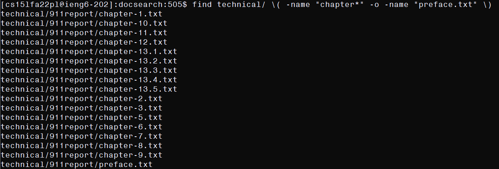

# Ode to Find

`find` is a useful command. Here are some cool options for it. The directory structure for the examples will be:

```
dir of execution/
    technical/
        test.txt  <--------- file
        911report/
        biomed/
        government/
            About_LSC/
            Alcohol_Problems/
            Env_Prot_Agen/
            Gen_Account_Office/
            Media/
            Post_Rate_Comm/
        plos/
```
Every directory without further subdirectories has many `.txt` files in it.

## `-maxdepth x`

`-maxdepth x` Specifies that `find` should only return files and directories that have a directory depth less than or equal to `x`. Here are some examples:  



```
find technical/ -maxdepth 0

technical/
```

This is a trivial example; all of the contents of `technical/`, to be found, require traversing into `technical/`. So, even if a directory is not traversed into, but is still tested by `find`, it will be returned. This is not a useful use of `-maxdepth`, but it is nice to know.



```
find technical/ -maxdepth 1

technical/
technical/911report
technical/biomed
technical/government
technical/plos
technical/test.txt
```

All of the directories and files within `technical/` have been included. The contents of all of the subdirectories have not been, though they exist. This is useful in the instance that 
I have some directory structure, with files and a metadata folder at a depth of 1, and I do not want to include the contents of the metadata folder in my find results.



```
find technical/ -maxdepth 2

technical/
technical/911report
...All of the files in 911report...
technical/biomed
...All of the files in biomed...
technical/government
technical/government/About_LSC
technical/government/Alcohol_Problems
technical/government/Env_Prot_Agen
technical/government/Gen_Account_Office
technical/government/Media
technical/government/Post_Rate_Comm
technical/plos
...All of the files in plos...
technical/test.txt
```

All of the directories and files within `technical/` and its immediate subdirectories were included. Whereas the files within `911report`, `biomed`, and `plos` were included, none of the files within `government` were included, because `government` only immediately contains subdirectories, but traversing them is at a depth of 3. So they are not traversed into, and the files within them are not returned. `-maxdepth` in general is useful if searching for a file in an immense directory structure, as it may be inefficient to search the whole structure with an unlimited `find` command, whereas using `-maxdepth` allows for a limited search to some depth, bypassing expensive searches into deep directories where the file is not if it is indeed within the specified depth of the root directory.

## `-type [d for directory, f for file, ]`

Specifies that `find` should only return files of a specified type. Here are some examples:



```
find technical/ -type f

...All of the files in 911report...
...All of the files in biomed...
...All of the files in government subdir...
...All of the files in plos...
technical/test.txt
```

This returns all of the files within the directory structure of `technical/`. This is useful for that very purpose: if I want a list of files in a directory structure, I can use `-type f` to get it very intuitively.



```
find technical/ -type d

technical/
technical/911report
technical/biomed
technical/government
technical/government/About_LSC
technical/government/Alcohol_Problems
technical/government/Env_Prot_Agen
technical/government/Gen_Account_Office
technical/government/Media
technical/government/Post_Rate_Comm
technical/plos
```

This returns all of the directories within the directory structure of `technical/`. Again, this is useful immediately: if I want the directory structure of a directory, I use `-type d` to get it.



```
find technical/ -maxdepth 1 -type f

technical/test.txt
```

Combining `-maxdepth 1` and `-type f`, I only get files at depth 1 of the search, and this is only `test.txt` in this instance. Thinking about the example of the metadata folder at depth 1 within a directory, this command is more useful than `-maxdepth 1` alone, because I probably do not care to have the metadata folder returned alongside the files external to it. This command will do that.

## `\( \), \!, -o` logical operators

Used within option arguments to modify the tests `find` runs to determine what it returns. `\( tests \)` forces the precedence of the tests in the order of evaluation, `\! test` corresponds to "fails `test`", `test1 -o test2` corresponds to "succeeds `test1` or `test2`". Here are some examples:



```
find technical/ \! -name "chapter*"

technical/
technical/911report
technical/911report/preface.txt
technical/biomed
...All of the othe subdirectories and files in technical...
```

This command uses the `\!` operator, corresponding to inversion of the test result, on the `-name` option to indicate that the command is looking for files or directories that do not have `chapter` in their name. These are only found in the `911report` subdir, and so only `preface.txt` is returned from there. Everything else is printed, because it does not have chapter in its name. This is useful if you know that you do not want to include some subset of files in your output.



```
find technical/ \(-name "chapter*" -o "preface.txt"\)

...All of the files in 911report...
```

This command looks for files either beginning with `chapter` or named `preface.txt`. These correspond to the contents of `911report` specifically, so all of the contents of `911report` are returned. Neither command alone would have done the same. This is useful when you are looking for two different types of files with different names in a directory structure, and want them to be in the same out. The `\( \)` are unnecessary in this instance.


```
find technical/ \( \! -type f \) -o \( -name "test.txt" \)

technical/
technical/911report
technical/biomed
technical/government
technical/government/About_LSC
technical/government/Alcohol_Problems
technical/government/Env_Prot_Agen
technical/government/Gen_Account_Office
technical/government/Media
technical/government/Post_Rate_Comm
technical/plos
technical/test.txt
```

The command specifies to find not files, which are only directories in this instance, or anything named `test.txt`, which is only that one file. So the out is all the directories and `test.txt`. This is not a particularly useful structure of command in and of itself, but it serves to demonstrate the modularity offered by the operators, as it allows more complex search filters to be constructed from a simpler set.