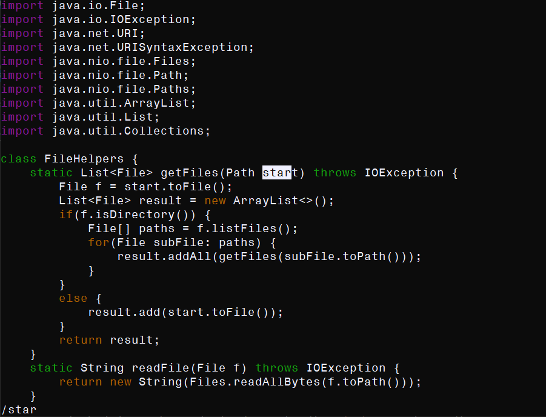
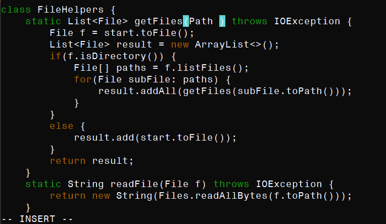
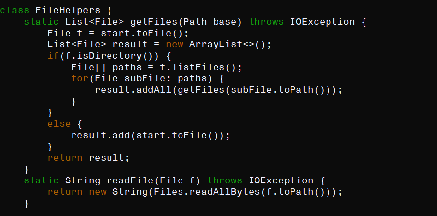
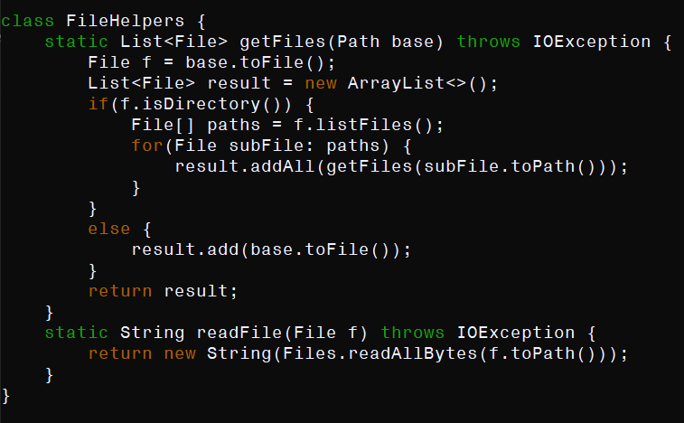

# Vim Exercise

## Demo

With reference to this code:
```
class FileHelpers {
    static List<File> getFiles(Path start) throws IOException {
        File f = start.toFile();
        List<File> result = new ArrayList<>();
        if(f.isDirectory()) {
            File[] paths = f.listFiles();
            for(File subFile: paths) {
                result.addAll(getFiles(subFile.toPath()));
            }
        }
        else {
            result.add(start.toFile());
        }
        return result;
    }
    static String readFile(File f) throws IOException {
        return new String(Files.readAllBytes(f.toPath()));
    }
}
```

I will demonstrate some of the efficiency that can be gained by using Vim's shortcuts/macros/commands, by showing how the `start` parameter in the `getFiles` method can be renamed to `base`. Having opened the file, here are the commands:

` / s t a r <Enter>` (6 keys pressed): This series of commands takes me to the first instance of `start` in the `getFiles` method. Specifically, `/` begins a search query for the next entered, which I say is `star`. I have dstarted at the top of the file (this does not always happen), so this immediately takes me to the first instance of `start` in `getFiles`. I press `<Enter>` to escape the search query entry.


` c e ` (8 keys pressed): This series of commands deletes everything up to the next move command. `c` denotes the start, and `e` moves to the end of the next word, in this case `start`.


` b a s e <Escape>` (13 keys pressed): This series of commands enters base as the new word and yanks it. `base` is entered as a word, `<Escape>` ends editing mode.


` n . n . ` (17 keys pressed): This series of commands replaces all remaining instances (of which there are specifically two) in the `getFiles` method. `n` advances the search (which is still active, I am just no longer entering the query) to the next term with `star`, reasonably an instance of `start`. `.` repeats the last series of commands, up to the point that no variables have changed between the input of those commands and the invocation of `.` such that the effect of those commands would be dependent on anything more than position (`c` does not count as dependent on position, as the notion of a word is abstracted in this context).


' : w q ' (20 keys pressed): This series of commands saves the file and exits vim to the command line.

# SCP compared to Vim

So far two methods of doing coding work remotely have been taught: completing the work locally and using the command `scp` to update the remote file from the local, or `ssh`ing to the remote and using vim to do the work on the remote machine itself. 

Here is an approximate time breakdown of what it takes to do the demo process with both procedures, as I have performed them myself:

## SCP

~23 seconds: 

1 second - open the file in VS code

10 seconds - complete the changes

15 seconds - finish typing the `scp` command (with optimizations: on Windows, I have a batch script that completes the long `cs15lfa22...` part for me)

4 seconds - `ssh`

4 seconds - `cd` to dir, `test.sh` finishes running

## Vim

~18 seconds:

5 seconds - `ssh`

15 seconds - complete the changes (with considerable slowness on my part - I am not yet used to vim, and simply fumbling the commands caused difficulty)

18 seconds - `test.sh` finishes running

## Conclusion:

I would say vim is actually the easily faster, and more sensible choice. Why am I trying to do everything on my home computer if that is not what I am actually trying to do? If the tools exist to complete the work remotely, that is far closer to the task I am trying to accomplish and as such it is naturally more simple and minimalist (for example, the `ssh` remote call functionality is cumbersome: I would rather just `ssh` onto the server to run `test.sh`). Something to point out: is VS code faster or slower than vim? In this case, it did not matter, but arguably vim is by design a faster framework for editing. I still do not think this matters, because fast text editors (such as: vim, ported to Windows (or emacs!)) exist for Windows. That is an arbitrary problem. I would in almost all cases where the problem must be remote edit on the remote.

The nature of the problems that I might have to solve remotely might be diverse; for example, I may be dealing with a remote machine that does not have tooling (i.e. vim) to work remotely. In this case I must work locally, but this is obviously non-ideal. A situation where I might prefer to work locally would be if the work that must be done remotely is work whose functionality is not specific to the nature of the remote machine (an example would be, say, machine learning training software that relies on special machinery). If I am writing a program that I can just as easily execute on my personal computer as I can on the remote, I might as well write it on my personal with all of the tooling and optimization that might imply, and then `scp` it over later. However, because remote work frequently involves servers, special hardware, I see this as the rarer case than the common.
