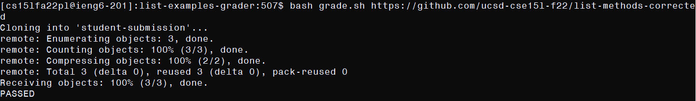

# Autograder

Here is the code for the `grade.sh` script that is run by an autograder implementation, which takes an argument a github repository link and outputs a grading judgment:

```
set -e

CPATH=".:lib/hamcrest-core-1.3.jar:lib/junit-4.13.2.jar"

rm -rf student-submission
git clone $1 student-submission
cp TestListExamples.java student-submission/
cp -R lib/ student-submission/
cd student-submission

if [[ ! -e ListExamples.java ]]
then
        echo "FAILED: ListExamples does not exist"
        exit 1
else
        true
fi

set +e

javac -cp $CPATH *.java 2> compile.txt

if [[ ! $? -eq 0 ]]
then
        more compile.txt
        echo "FAILED: Did not compile"
        exit 1
else
        true
fi

java -cp $CPATH org.junit.runner.JUnitCore TestListExamples > testout.txt
grep -q "FAILURES!!!" testout.txt
if [[ $? -eq 0 ]]
then
        grep "Tests run" testout.txt > testline.txt
        grep -o -E "[0-9]+" testline.txt > testline2.txt
        RUN=$(head -1 testline2.txt)
        FLD=$(tail -1 testline2.txt)
        echo "FAILED $FLD/$RUN"
        exit 1
else
        echo "PASSED"
        exit 0
fi
```

Here are examples of its execution on various repositories:

## Examples

This is a repository with a bug in one of the tested methods. As a result, it fails one of three total tests that are run. This is reported, and from that a grade or performance can be deduced.


This is the same as the first repository with those spoken bugs corrected. It returns a passed status, indicating a full grade.



This is a different repository which does not compile. This is reported with a failing grade, because that is a sensible judgment. The compilation error is also specifically reported, as a compilation error should be a trivial mistake, whereas it is possibly unclear if specific bug test failures should be reported (depending on the intentions of the teacher). 


## Trace

I will give a trace of the first example:

1. The lines `set -e` to `cd student-submission` run as intended. In this time, a variable `CPATH` is created to hold the relative location of the junit libraries in a repository, redundant `student-submission` folders are deleted (from previous executions), the repository in the arguments (`$1`) is cloned into a directory `student-submission`, the tests (`TestListExamples.java`) is copied into the newly cloned repository dir along with the junit libraries (`lib/`), and the script enters the dir.

2. The `if [[ ! -e ListExamples.java ]] ... fi` statement is hit. This checks that list `ListExamples.java` does not exist (just `-e ListExamples.java` would be the opposite) in the repository, which it does, so the first second is hit and `true` runs, which is to say nothing occurs. The output message of `FAILED: ListExamples.java does not exist` does not echo and the program does not exit with non-zero exit code.

3. `set +e` executes. This unsets the script's break on non-zero exit code rule because the script must report (therefore continue running) if the `javac` fails. The line `javac -cp $CPATH *.java 2> compile.txt` runs, compiling the program, and outputs compiler exceptions to compile.txt. This repo does not fail to compile, so `javac` exits with zero and the `if [[ ! $? -eq 0 ]] ... fi` statement, which checks if `javac` exits with non-zero exit code, hits its second branch and does nothing. The first branch would have reported the compile error (`more compile.txt`), output a fail message, and exited with non-zero exit code.

4. `java -cp $CPATH org.junit.runner.JUnitCore TestListExamples > testout.txt` runs. This actually runs the compiled tests (`TestListExamples`) and saves the output to `testout.txt`. If the program failed, testout.txt will contain the line `FAILURES!!!`, so I use grep to verify this. `-q` on grep means that `grep` exits with non-zero exit code if it does not find a match, and with zero if it does. This repo fails a test, so the first branch of `if [[ $? -eq 0 ]] ... fi` is hit. `grep` is used to take the line containing the number of tests run from the junit output. Then, all numbers are parsed from that line with `grep -o -E "[0-9]+" testline.txt > testline2.txt`. There will be two of them, in the order of how many tests were run and how many failed, so I take these numbers with the lines `RUN=$(head -1 testline2.txt)` and `FLD=$(tail -1 testline2.txt)`. These take the first and last numbers respectively in the line (of which there are two). Finally, these statistics are reported alongside a `FAILED` message with `echo "FAILED $FLD/$RUN"` and the script exits with non-zero exit code. If the second branch had been hit, the script echoes `PASSED` and exits with 0.